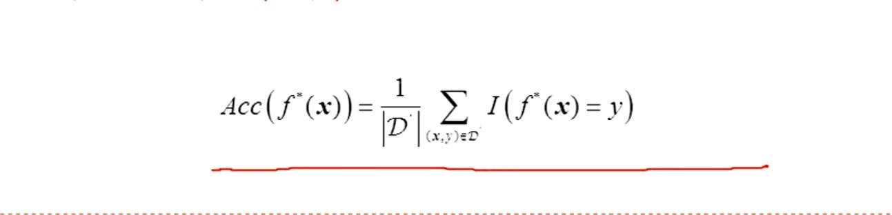
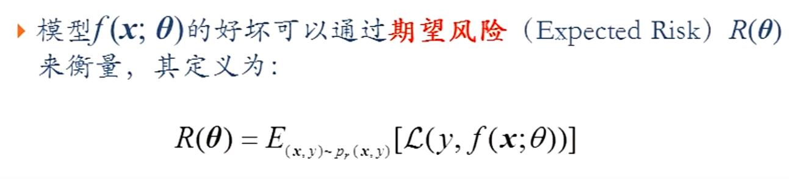
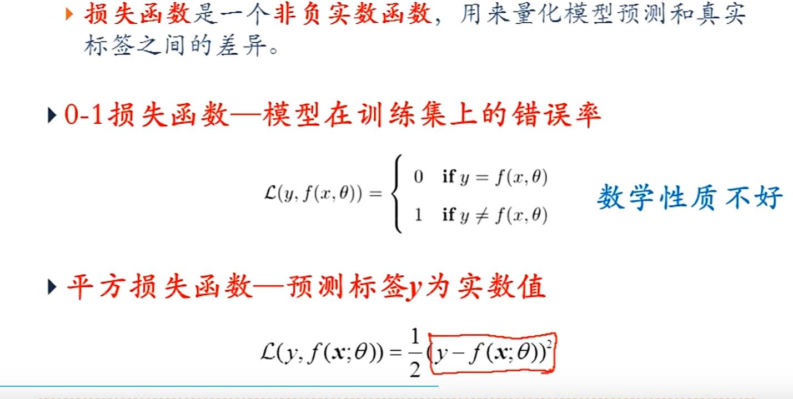
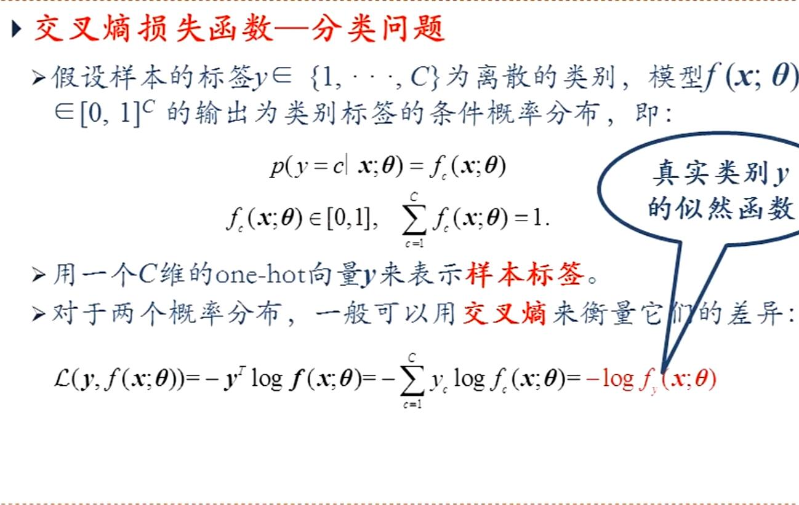
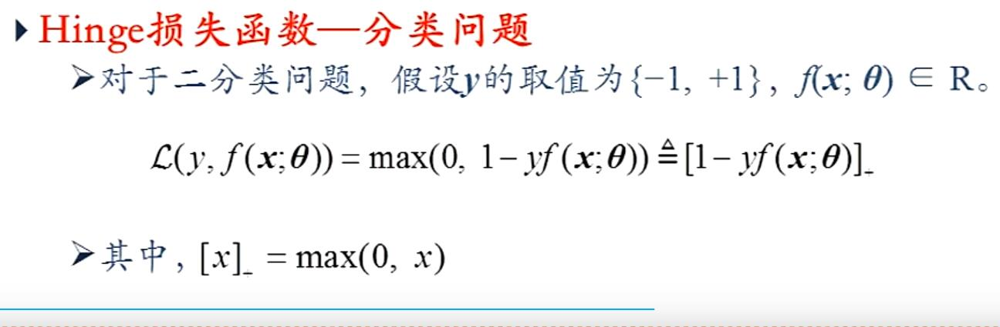
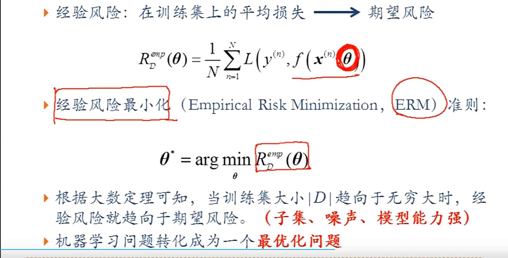

# 第二节内容
所有特征构成的D维向量称为特征向量,每一维都是一个特征  
训练集必须是独立同分布得到也就是说样本间有一定的关系  
标签或条件概率是模型的输出  
特征是模型的输入  
得到模型f*(x)用测试数据去评价模型的好坏  
计算预测结果的准确率
|D‘|表示数据的个数  
机器学习的三要素:模型、学习准则、优化算法  
模型好坏 但是没有所有的样本不能求 所以用"经验风险"去近似"期望风险"  
损失函数  
损失是非负的 用来量化预测值与真实值之间的差异  
经验风险与经验风险最小化  
欠拟合:拟合不足  
过拟合:模型在训练集上错误率很低,但在未知数据集上错误率很高 全都拟合准了(不好) 模型的泛化能力不强  
过拟合往往由于训练数据少和数据中有噪声等原因造成  
