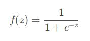
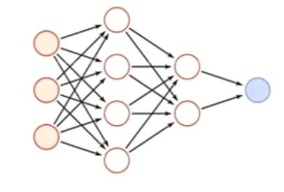

# 绪论
神经网络:神经网络是一种复杂的函数,可以将它看作一个黑盒子。有输入(特征)有输出(结果)。
可以用来解决:组合优化问题:商旅问题(TSM)  模式识别 数据拟合(建模) 目标检测 实例分割 图像处理 控制 风格迁移等  
深度学习:层数比较多,比较复杂的神经网络模型 是机器学习的一种。  
用一条直线或平面可分的称为线性可分  
神经网络可以用来模式识别  
One-hot向量只有一个分量激活的向量例如[0,1,0]
BP模型(误差反向传播模型)是一种好用的模型  
现在模式识别一般用卷积神经网络(CNN)
数据建模:只给输入输出数据 对输入输出的关系建模  
机理模型:通过对象的原理建模 泛化能力比较强  
y = kx + b 线性 要求预测值与实际值之间的差距尽量小  
LeNet-5是一个非常成功的卷积神经网络  
神经网络由数据驱动 (data-driven) 数据->数据集(dataset) 用数据集去训练模型  
一般的卷积神经网络由卷积层、激活函数(Sigmoid 是常用的非线性的激活函数)、池化层、全连接层构成。  
池化层:把一个大图像变成一个小图像的层  
卷积核(滤波器):卷积核的值也就是神经网络的权值(weight)  
Sigmoid函数: 

---
人工神经网络(ANN)简称神经网络   
生物神经网络是生物大脑中的神经元组成的网络是世界上做复杂的系统  
神经元由轴突和树突组成  
树突接收其他神经元传来的信号 轴突输出信号、传递信号  
神经元是一个多输入单输出的模型  
神经网络看作是由一组参数控制的复杂函数 神经网络的参数可以由机器学习的方式来从数据中学习  
神经网络和深度学习并不等价 深度学习可以采用神经网络模型也可以采用其他模型 只是神经网络模型在深度学习中比较常用  
解决贡献度分配问题  
神经网络也可以看作是有一组参数控制的复杂函数

一种前馈神经网络  
人工智能的研究领域:  
1. 感知:视觉和语音
2. 学习:模拟人的学习能力 主要从数据中进行学习 学习包括:监督学习(预测)(回归)、无监督学习(聚类)、强化学习等 
3. 认知:模拟人的认知能力